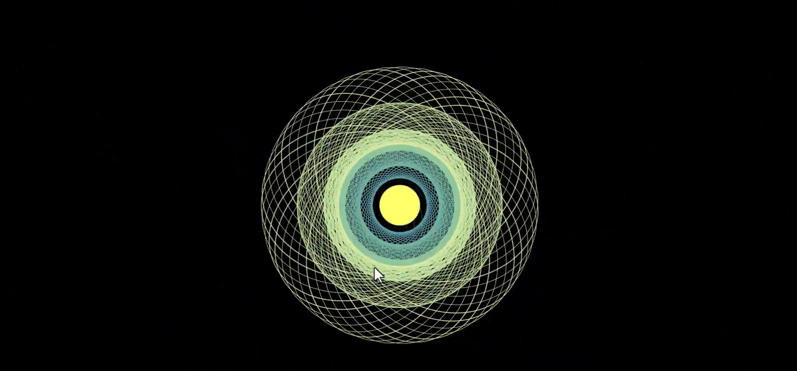
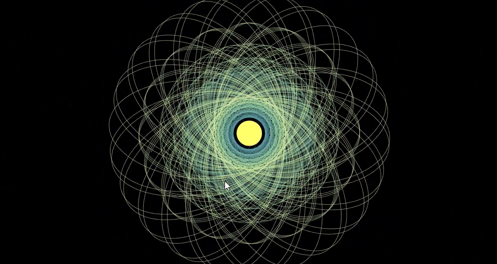
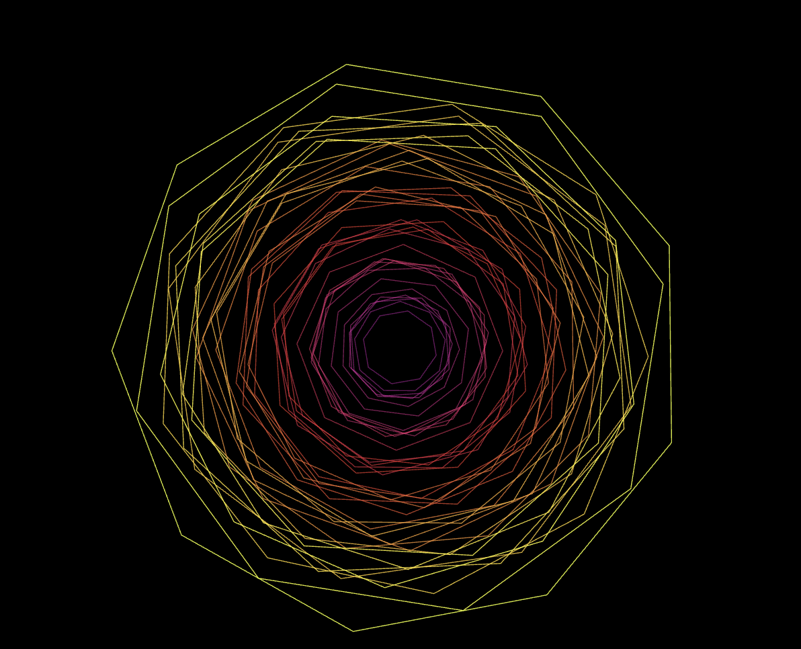
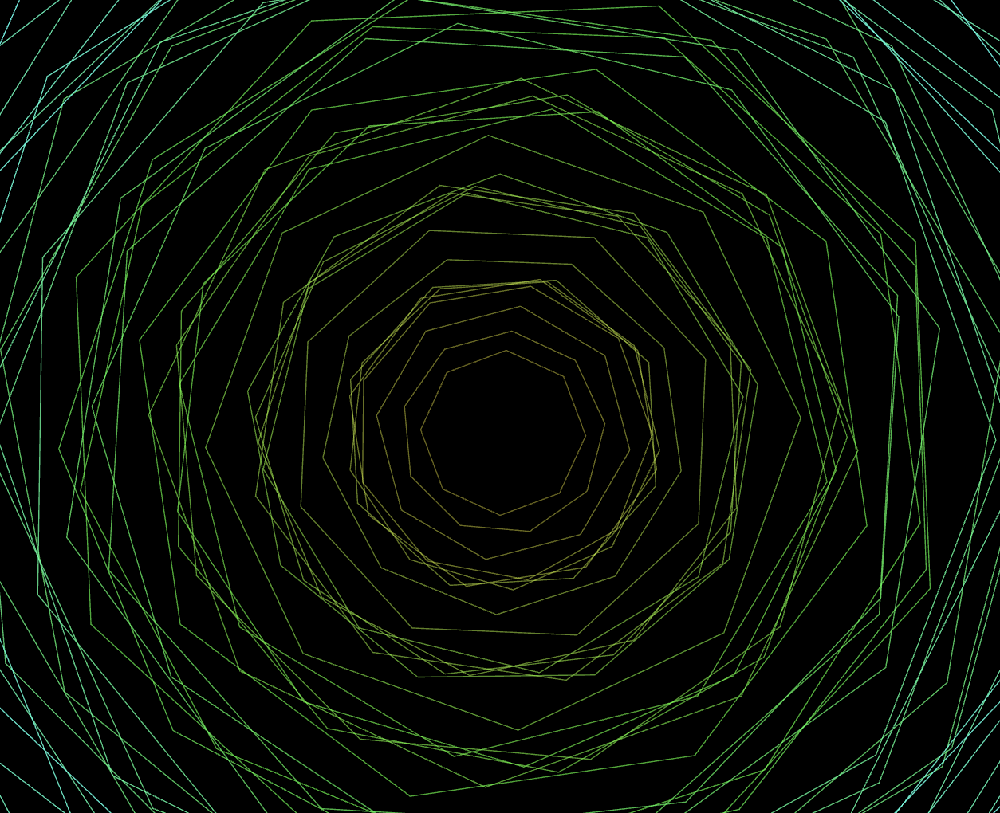

# zhxu0527_9103_tut9

## **1. Imaging Technique Inspiration**

#### Inspired imaging technique:

I am inspired by a video from Youtube. The specific aspect I want to incorporate is the **dynamic scaling mechanic** driven by user input. By moving the mouse or clicking, the geometric layers expand and contract, mimicking a breathing organism or a shifting lens. 

This technique is beneficial because it creates a highly responsive feedback loop, fulfilling the **"User Input"** mechanic requirement. It transforms simple mathematical lines into an immersive visual experience that encourages users to explore the relationship between movement and scale.

## **2. Coding Technique Exploration**

#### Selected Tool: p5.js (Mapping Function)

To achieve the dynamic scaling effect, I will utilize the map() function in p5.js. This technique allows me to translate the raw coordinates of user input (mouseX) into a specific range of scale values (e.g., 0.5 to 3.0). By linking the mouse's horizontal position to the radii of the geometric shapes, the mandala-like patterns will expand or contract smoothly as the user interacts with the canvas. It makes the abstract "breathing" effect from Part 1 technically possible.

### Resources
* **Example Implementation and Code:** [p5.js Mouse Functions Reference](https://p5js.org/reference/p5/mousePressed/)